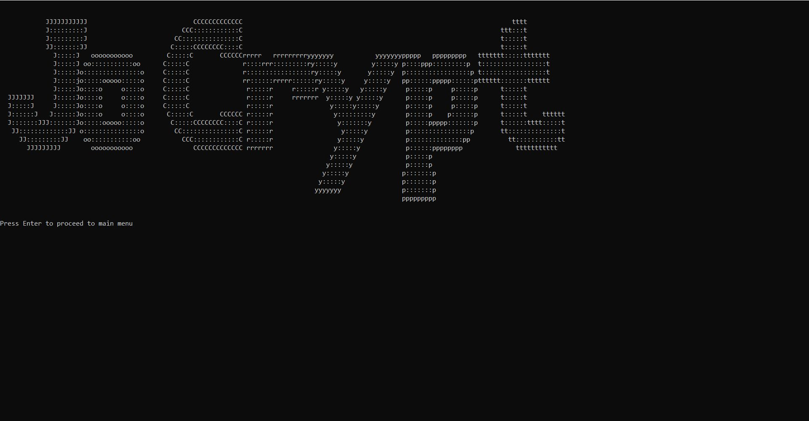
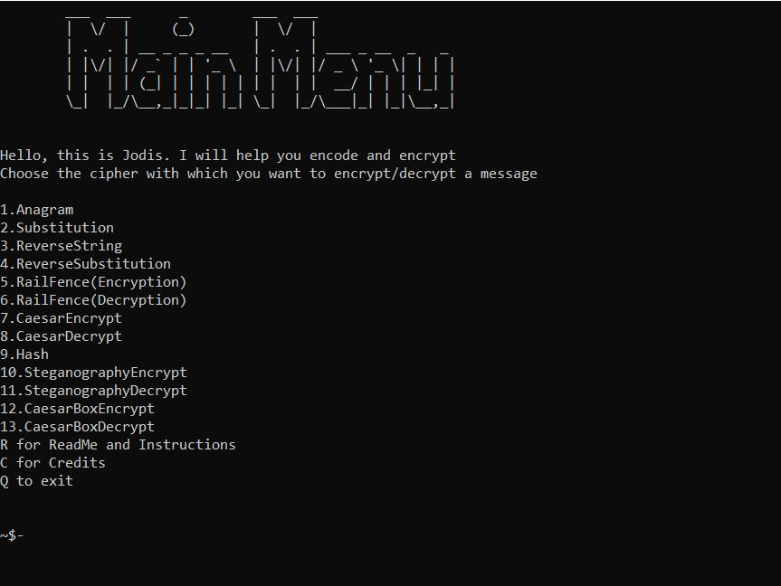

# [JoCrypt](http://jocrypt.sidjo.repl.run)
### Click to Try/Run it on Repl

Encryption Program.

# MySQL Support

All the records of encryptions will be maintained. MySQL needs to be installed on your system for it obviously.
For the ease of finding a record, A username is given to you(by yourself) every time you operate the program.
All encryptions will be saved under that username and will be timestamped. The message you wanted to encrypt will also be saved for future references.

This support can be avoided by using the <b>JoCrypt_NoDB.py</b> script which basically performs the same functions but without the MySQL elements.

#### If you are unable to run MySQL on your device, You will have to run the JoCrypt_NoDB.py . It is the same as the original file only limitation is no record is maintained and no MySQL is required.

# Executable

You can Convert any script to an executable using <b>py2exe</b> so it can work on a machine with no python.
Very Handy indeed. Updated <b>py2exe.py</b> to make this process more streamlined.

# Support for Linux and Android
Now this framework can be run on Linux and Android.
All you have to do is clone the whole repository and run only <b>JoCryptL.py</b> it in the legacy edition in which all the windows kernel functions have been removed.

To run it on Android, download Termux and clone the repository in the linux environment.
Running this project on Android is NOT recommended due to inadequate support for ascii art.

## Packages required
### Make sure these packages are installed in your system:
##### os
##### msvcrt
##### subprocess
##### ctypes
##### PIL
##### itertools
##### hashlib
##### stegano
##### math
##### pandas
##### mysql
##### mysql.connector

### Alternatively, you can use the package installer file

Run <b>installedPackages.py</b> and it will install all the required packages. It will also update pip.

Make sure pip is installed on your machine.

## Run 'setup.py'

This is a Program meant for Basic encryption and decryption processes.

It will only work on windows machines...
If you want it to work on macintosh/Linux etc., remove the "maximize console" part. (Done in <b>JoCryptL.py</b>)

You will require a password to start the program. So,  in <b>Pass.txt</b>, enter the <em>md5 hashed</em> of your password and enter the actual password that you've set when prompted. Default --> "SecurePassword@!".

Here are two websites you can use to generate a md5 hash of your password:
##### [md5hashgenerator](https://www.md5hashgenerator.com/)
##### [passwordsgenerator](https://passwordsgenerator.net/md5-hash-generator/)  
\
\
Create files as per the instructions in the program before execution of segments or run <b>setup.py</b>

Making hidden signs towards the key and shifts for the encryption are preferred.

Use it well.

### #MakeItSafe
